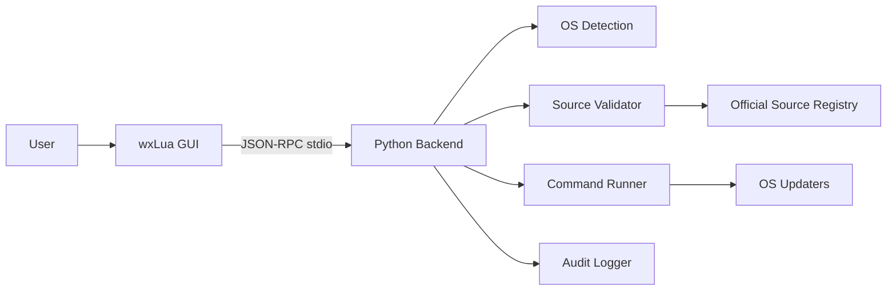

# VeriPatch Architecture

## Overview

VeriPatch uses a **two-process architecture**: a wxLua GUI frontend and a Python backend connected via **line-delimited JSON-RPC** over stdin/stdout.



## Components

### GUI Layer (`gui/`)

- **Technology**: wxLua (native OS widgets via wxWidgets)
- **Entry point**: `gui/main.lua`
- **Modules**:
  - `app/ui/main_frame.lua` — Main window, update list, apply controls
  - `app/ui/view_model.lua` — Pure logic for labels, gating, and apply params
  - `app/ipc/client.lua` — JSON-RPC client spawning Python backend

The GUI spawns `python -m veripatch` for each IPC call. Persistent sessions are supported via `JsonRpcClient` (Python) or by keeping stdin open across multiple JSON-RPC lines; use `shutdown` to end the session cleanly.

### Python IPC Client

```python
from veripatch.ipc import JsonRpcClient

with JsonRpcClient() as client:
    client.call("ping")
    client.call("check_updates")
```

### Backend Layer (`backend/veripatch/`)

| Module | Responsibility |
|--------|----------------|
| `detection/os_detect.py` | OS, version, distro, package manager detection |
| `sources/registry.py` | Official source registry per OS |
| `sources/validator.py` | Command validation against registry |
| `execution/runner.py` | Validated subprocess execution with dry-run and timeouts |
| `execution/parsers.py` | Parse official CLI output into update items |
| `updaters/` | OS-specific check, list, and apply workflows |
| `privileges/` | Elevation detection, guidance, and audit logging |
| `observability/` | Structured logging and diagnostics RPC |
| `ipc/` | JSON-RPC server on stdin/stdout |

### AgentMesh (`agentmesh/`)

Optional asyncio multi-agent tooling for development workflows (design review, CI checks). See [agentmesh/docs/AGENTMESH.md](../agentmesh/docs/AGENTMESH.md).

### IPC Protocol

Line-delimited JSON-RPC 2.0:

| Method | Description |
|--------|-------------|
| `ping` | Health check |
| `detect_os` | Returns OS info and elevation status |
| `list_sources` | Returns official sources for current OS |
| `check_updates` | Validates sources and lists available updates |
| `apply_updates` | Applies updates (dry-run by default) |
| `diagnostics` | Returns audit tail, capabilities, and session stats |
| `shutdown` | Gracefully ends a persistent IPC session |

Request example:

```json
{"jsonrpc":"2.0","method":"check_updates","params":{},"id":1}
```

Response example:

```json
{"jsonrpc":"2.0","result":{"check":{...},"updates":{...}},"id":1}
```

## Data Flow

1. User opens GUI → GUI calls `detect_os`
2. Backend detects OS and returns metadata
3. GUI calls `list_sources` → registry filtered by OS
4. User clicks Refresh → GUI calls `check_updates`
5. Updater validates commands via `SourceValidator`, then runs official CLIs
6. Approved actions logged to `.veripatch/audit.log`
7. User clicks Apply (Dry Run) → `apply_updates` with `dry_run: true`
8. Real apply requires confirmation token + elevated privileges

## Security Model

- **Allowlist-only**: Every command must match the official source registry
- **Audit trail**: All approvals, rejections, and privileged actions are logged
- **Confirmation gate**: Real apply requires explicit token and elevation
- **Dry-run default**: Apply RPC defaults to dry-run; env `VERIPATCH_DRY_RUN=1` forces it globally
- **No arbitrary downloads**: Backend never fetches from unofficial URLs

## Future Work

- GUI integration with persistent backend process
- Windows Update Agent COM integration
- Interactive elevation request flows per OS (UAC, sudo, pkexec)
- Code signing and update verification
