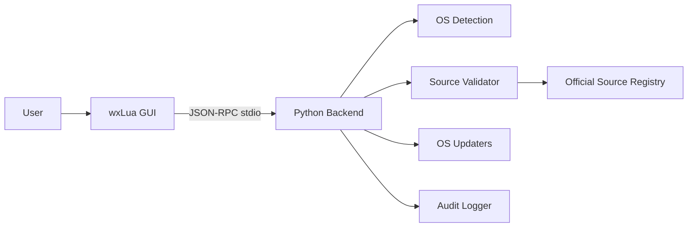

# VeriPatch Architecture

## Overview

VeriPatch uses a **two-process architecture**: a wxLua GUI frontend and a Python backend connected via **line-delimited JSON-RPC** over stdin/stdout.



## Components

### GUI Layer (`gui/`)

- **Technology**: wxLua (native OS widgets via wxWidgets)
- **Entry point**: `gui/main.lua`
- **Modules**:
  - `app/ui/main_frame.lua` — Main window, update list, dry-run apply
  - `app/ipc/client.lua` — JSON-RPC client spawning Python backend

The GUI spawns `python -m veripatch` for each IPC call (foundation release). Future versions may use a persistent backend process.

### Backend Layer (`backend/veripatch/`)

| Module | Responsibility |
|--------|----------------|
| `detection/os_detect.py` | OS, version, distro, package manager detection |
| `sources/registry.py` | Official source registry per OS |
| `sources/validator.py` | Command validation against registry |
| `updaters/` | OS-specific update workflows (stubbed apply) |
| `privileges/` | Elevation detection and audit logging |
| `ipc/` | JSON-RPC server on stdin/stdout |

### IPC Protocol

Line-delimited JSON-RPC 2.0:

| Method | Description |
|--------|-------------|
| `ping` | Health check |
| `detect_os` | Returns OS info and elevation status |
| `list_sources` | Returns official sources for current OS |
| `check_updates` | Validates sources and lists available updates |
| `apply_updates` | Applies updates (dry-run by default) |

Request example:

```json
{"jsonrpc":"2.0","method":"check_updates","params":{},"id":1}
```

Response example:

```json
{"jsonrpc":"2.0","result":{"check":{...},"updates":{...}},"id":1}
```

## Data Flow

1. User opens GUI → GUI calls `detect_os`
2. Backend detects OS and returns metadata
3. GUI calls `list_sources` → registry filtered by OS
4. User clicks Refresh → GUI calls `check_updates`
5. Updater validates commands via `SourceValidator`
6. Approved actions logged to `.veripatch/audit.log`
7. User clicks Apply (Dry Run) → `apply_updates` with `dry_run: true`

## Security Model

- **Allowlist-only**: Every command must match the official source registry
- **Audit trail**: All approvals, rejections, and privileged actions are logged
- **Elevation**: Detected but not auto-requested in v0.1.0 (stub)
- **No network downloads**: Foundation release does not fetch arbitrary URLs

## Future Work

- Persistent backend process with streaming updates
- Real WUA COM integration on Windows
- Real `softwareupdate` and package manager execution
- Elevation request flows per OS (UAC, sudo, pkexec)
- Code signing and update verification
