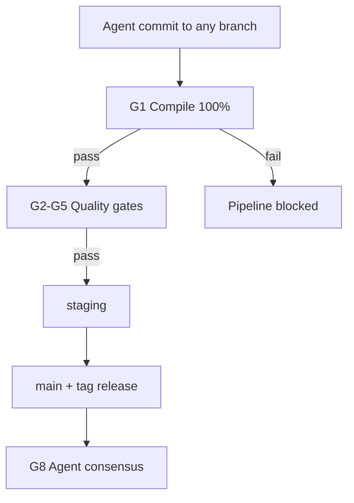

# VeriPatch Quality Gates (Non-Negotiable)

**Status:** Permanent global policy — zero exceptions.  
**Effective:** `2026-06-22T20:00:00.000000+00:00`  
**Owner:** Riley Santos — DevOps Automator

All code promotion to **staging** or **production** (`main` + tagged releases) must pass every gate below. Failure at any gate **blocks all further CI/CD progression**.

## Gate summary

| # | Gate | Threshold | Blocks | CI job |
|---|------|-----------|--------|--------|
| G1 | **Compilation** | 100% successful compile | staging, production | `compile` |
| G2 | **Unit tests** | ≥ 90% pass rate | staging, production | `unit-tests` |
| G3 | **Integration tests** | 100% pass (all integration tests) | staging, production | `integration-tests` |
| G4 | **Static analysis** | Zero critical/high findings | staging, production | `static-analysis` |
| G5 | **Governance** | Timestamps + quality gate docs valid | staging, production | `governance` |
| G6 | **Engineering lead approval** | Manual — required reviewer | staging only | `staging-promotion` environment |
| G7 | **Release manager approval** | Manual — required reviewer | production only | `production-release` environment |
| G8 | **Agent consensus** | `approved` + `production_ready` | production tag only | `release.yml` validate |

## G1 — Compilation (100%, non-negotiable)

**Prerequisite for all stable release deployments.**

- `python -m compileall` on all backend source — zero errors
- `python -m build` produces wheel + sdist without failure
- GUI Lua syntax check via `luacheck`
- **Any compilation failure automatically blocks the entire pipeline.**

Script: `scripts/run-compile-gate.py`

## G2 — Unit tests (≥ 90% pass rate)

- Scope: `tests/backend/` (excludes `tests/integration/`)
- Minimum pass rate: **90%** of collected tests
- Measured via pytest JUnit XML output
- Coverage advisory: ≥ 80% (existing `--cov-fail-under=80` retained)

Script: `scripts/run-unit-test-gate.py --min-pass-rate 90`

## G3 — Integration tests (100% pass)

- Scope: `tests/integration/`
- All integration tests must pass — no partial credit
- IPC, socket, and protocol tests included

## G4 — Static analysis (critical/high blocked)

| Tool | Scope | Fail condition |
|------|-------|----------------|
| `ruff check` | `backend/veripatch`, `tests/` | Any error-level lint |
| `mypy` | `backend/veripatch` | Type check failure |
| `bandit` | `backend/veripatch` | **HIGH** or **CRITICAL** severity findings |

Script: `scripts/run-static-analysis-gate.py`

## G5 — Governance validation

- `scripts/check-governance-timestamps.py` passes
- `governance/QUALITY_GATES.md` present

## G6 — Engineering lead approval (staging)

**Mandatory manual gate before merge to `staging`.**

- GitHub Environment: `staging-promotion`
- Required reviewer role: **Engineering Lead** (see `.github/CODEOWNERS`)
- Configured in repository Settings → Environments → `staging-promotion`
- Workflow: `.github/workflows/staging-promotion.yml`

## G7 — Release manager approval (production)

**Mandatory manual gate before production deployment.**

- GitHub Environment: `production-release`
- Required reviewer role: **Release Manager** (see `.github/CODEOWNERS`)
- Configured in repository Settings → Environments → `production-release`
- Workflow: `.github/workflows/release.yml` → `publish` job

## G8 — Agent consensus (stable release)

- `release/consensus/v{version}.json` must exist
- `consensus.approved: true` and `consensus.production_ready: true`
- Required agents: `devops-automator`, `code-reviewer`, `reality-checker`
- Validated by `scripts/validate-release-consensus.py`

## Promotion flow



## Local verification

Run all gates locally before opening a promotion PR:

```bash
python scripts/run-quality-gates.py
```

---

`last_updated`: `2026-06-22T21:00:00.000000+00:00`
